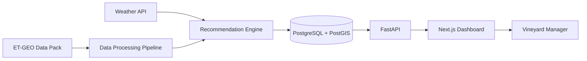

# VineMind AI
# Software Architecture Document (SAD)

---

| Property | Value |
|----------|-------|
| Document ID | VM-003 |
| Version | 1.0 |
| Status | Draft |
| Standard | ISO/IEC/IEEE 42010 Inspired |
| Project | VineMind AI |
| Hackathon | TerraClim ET-GEO Hackathon 2026 |
| Author | Jeffrey Moepi |
| Last Updated | 16 July 2026 |
| Related Documents | VM-000, VM-001, VM-002 |

---

# Table of Contents

1. Introduction
2. Architecture Goals
3. Architectural Principles
4. Quality Attributes
5. C4 Architecture Model
6. High-Level System Architecture
7. Logical Architecture
8. Runtime Architecture
9. Data Flow
10. Component Responsibilities
11. Deployment Architecture
12. Security Architecture
13. Scalability Strategy
14. Architectural Decisions (ADRs)
15. Risks & Trade-offs
16. Future Evolution

---

# 1. Introduction

This document defines the overall software architecture of VineMind AI.

The objective is to transform TerraClim ET-GEO datasets into explainable irrigation recommendations using a modular, cloud-native architecture.

The architecture prioritises:

- Maintainability
- Scalability
- Explainability
- Performance
- Reproducibility

---

# 2. Architecture Goals

The architecture shall:

✔ Transform geospatial datasets into irrigation recommendations

✔ Support interactive visualisation

✔ Keep processing and presentation loosely coupled

✔ Enable future AI integration

✔ Be reproducible with Docker

✔ Support cloud deployment

✔ Remain understandable by future developers

---

# 3. Architectural Principles

## Separation of Concerns

Each layer has one responsibility.

- UI presents information
- API exposes services
- Processing layer analyses data
- Database stores data

---

## Explainability

Every recommendation must be traceable.

No "black box" decisions.

---

## Cloud Native

Every service should be independently deployable.

---

## API First

Frontend communicates exclusively through REST APIs.

---

## Data Driven

Recommendations originate from measurable observations.

Never hard-code operational values.

---

# 4. Quality Attributes

| Attribute | Priority |
|------------|----------|
| Availability | High |
| Maintainability | High |
| Scalability | High |
| Security | Medium |
| Performance | High |
| Extensibility | High |
| Reliability | High |
| Explainability | Critical |

---

# 5. C4 Architecture Model

## Level 1 — System Context

```text
                    Vineyard Manager
                           │
                           │
                   Uses VineMind AI
                           │
        ┌──────────────────┼──────────────────┐
        │                  │                  │
 TerraClim Data      Weather API        Authentication
```

The system receives ET-GEO datasets, optional weather information, and serves recommendations to vineyard managers through a web application.

---

## Level 2 — Containers

```text
┌───────────────────────────────────────────────┐
│                 VineMind AI                   │
├───────────────────────────────────────────────┤
│                                               │
│  Next.js Frontend                             │
│                                               │
│  FastAPI Backend                              │
│                                               │
│  Recommendation Engine                        │
│                                               │
│  Geospatial Processing Pipeline               │
│                                               │
│  PostgreSQL + PostGIS                         │
│                                               │
└───────────────────────────────────────────────┘
```

Each container has a single responsibility and communicates through well-defined interfaces.

---

## Level 3 — Components

### Frontend

- Dashboard
- Interactive Map
- Block Details
- Reports
- Settings

---

### Backend

- Recommendation Service
- Analytics Service
- Weather Service
- Reporting Service
- Authentication Service

---

### Processing

- Raster Loader
- Polygon Aggregator
- ET Calculator
- NDVI Processor
- Stress Scoring Engine

---

# 6. High-Level System Architecture



---

# 7. Logical Architecture

Presentation Layer

↓

Application Layer

↓

Domain Layer

↓

Data Layer

↓

Infrastructure Layer

---

## Presentation Layer

Responsibilities

- Dashboard
- Maps
- Charts
- Reports

Technology

Next.js

React

Tailwind

---

## Application Layer

Responsibilities

- Business logic
- Recommendation orchestration
- Authentication

Technology

FastAPI

---

## Domain Layer

Contains:

- Water Stress Model
- Recommendation Engine
- Vineyard Rules

---

## Data Layer

Stores

- Vineyard Blocks
- Historical ET
- NDVI
- Weather
- Recommendations

---

## Infrastructure Layer

External services

- PostgreSQL
- Docker
- Weather APIs

---

# 8. Runtime Architecture

Daily Workflow

```text
Scheduler

↓

Load Raster Files

↓

Aggregate by Vineyard Block

↓

Calculate Metrics

↓

Generate Recommendation

↓

Persist Results

↓

Expose REST API

↓

Dashboard Refresh
```

---

# 9. Data Flow

```text
GeoTIFF

↓

Raster Loader

↓

GeoPandas

↓

Block Statistics

↓

Stress Calculation

↓

Recommendation Engine

↓

Database

↓

REST API

↓

Dashboard
```

---

# 10. Component Responsibilities

## Recommendation Engine

Responsible for:

- Water Stress Score
- Recommendation
- Confidence

---

## Geospatial Processor

Responsible for:

- Reading rasters
- Polygon intersection
- Statistics

---

## Dashboard

Responsible for:

- Visualisation
- User interaction

---

## Database

Responsible for:

- Historical storage
- Spatial queries

---

# 11. Deployment Architecture

Browser

↓

Vercel

↓

FastAPI

↓

Railway

↓

PostgreSQL/PostGIS

↓

Persistent Storage
```

Containerisation

Docker Compose

---

# 12. Security Architecture

Authentication

JWT

HTTPS

Input Validation

Role-Based Access

Secrets stored in environment variables

Prepared SQL statements

---

# 13. Scalability Strategy

Future scaling options include:

- Background workers

- Redis caching

- Object storage

- Multiple API instances

- Message queues

- Kubernetes deployment

---

# 14. Architecture Decision Records (ADRs)

## ADR-001

Decision

Use FastAPI.

Reason

Excellent support for scientific Python libraries.

---

## ADR-002

Decision

Use PostgreSQL + PostGIS.

Reason

Industry-standard spatial database.

---

## ADR-003

Decision

Use Next.js.

Reason

Fast development and modern React ecosystem.

---

## ADR-004

Decision

Recommendation engine remains independent.

Reason

Allows replacement by machine learning models later.

---

# 15. Risks

Large raster processing

Mitigation

Pre-compute statistics.

---

Weather API unavailable

Mitigation

Use cached forecasts.

---

Missing imagery

Mitigation

Use previous valid observations.

---

# 16. Future Evolution

Future versions may include:

- Drone imagery
- IoT soil sensors
- AI forecasting
- Mobile application
- Multi-farm support
- Automated irrigation
- Predictive yield analysis

---

# Conclusion

The VineMind AI architecture follows a modular, layered design that separates geospatial processing, business logic, data persistence, and user interaction.

This architecture provides a maintainable and extensible foundation for transforming ET-GEO datasets into transparent irrigation recommendations while remaining suitable for future commercial deployment.