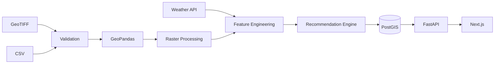

# VineMind AI
# Data Architecture

# Table of Contents

1. Introduction
2. Data Architecture Principles
3. Data Sources
4. Data Classification
5. Data Lifecycle
6. Data Pipeline
7. Canonical Data Model
8. Storage Strategy
9. Processing Strategy
10. Historical Data
11. Derived Intelligence
12. Data Quality
13. Metadata Management
14. Security & Governance
15. Future Data Platform

---

# 1. Introduction

VineMind AI transforms raw environmental observations into irrigation recommendations.

Unlike traditional GIS applications that visualise datasets independently, VineMind AI combines multiple scientific datasets into a unified operational model.

The objective of the data architecture is to ensure that every recommendation is:

- Traceable
- Explainable
- Repeatable
- Scientifically defensible
- Efficient to compute

---

# 2. Data Architecture Principles

## Single Source of Truth

Every vineyard block should have one authoritative representation.

No duplicated block information.

---

## Immutable Raw Data

Original ET-GEO datasets are never modified.

Raw files remain available for auditing.

---

## Derived Intelligence

Recommendations are never stored as raw input.

They are derived from environmental observations.

---

## Explainability

Every recommendation must be reproducible from historical data.

---

## Incremental Processing

Only newly available datasets should trigger recalculation.

---

# 3. Data Sources

## Internal Data Sources

| Dataset | Source | Format |
|----------|--------|--------|
| Vineyard Polygons | ET-GEO | Shapefile / GeoPackage |
| ETa | ET-GEO | GeoTIFF |
| ETo | ET-GEO | GeoTIFF |
| Crop Coefficient | ET-GEO | GeoTIFF |
| NDVI | ET-GEO | GeoTIFF |
| Phenology | ET-GEO | Excel / CSV |
| Soil Moisture | ET-GEO | CSV / Raster |

---

## External Data Sources

| Dataset | Provider |
|----------|----------|
| Weather Forecast | OpenWeather |
| Rainfall Forecast | OpenWeather |
| Temperature | OpenWeather |

Future

- IoT Sensors
- Drone Imagery
- Weather Stations

---

# 4. Data Classification

Level 1

Raw Data

Examples

GeoTIFF

CSV

Shapefiles

---

Level 2

Processed Data

Examples

Average ETa

Average NDVI

Average Soil Moisture

Per Vineyard Block

---

Level 3

Analytical Data

Examples

Stress Score

Recommendation

Water Budget

Priority Rank

---

Level 4

Presentation Data

Dashboard Cards

Charts

Reports

Maps

---

# 5. Data Lifecycle

```text
Raw Data

↓

Validation

↓

Cleaning

↓

Spatial Aggregation

↓

Feature Engineering

↓

Water Stress Analysis

↓

Recommendation Engine

↓

Database

↓

REST API

↓

Dashboard
```

---

# 6. End-to-End Data Pipeline



---

# 7. Canonical Data Model

Each Vineyard Block becomes the central business entity.

Everything relates to it.

```text
Vineyard Block

├── Geometry

├── Cultivar

├── Area

├── Phenology

├── ET History

├── NDVI History

├── Soil Moisture

├── Weather

├── Recommendations

└── Reports
```

This prevents duplicate logic across services.

---

# 8. Storage Strategy

## Raw Storage

Purpose

Preserve original datasets.

Technology

Filesystem

Future

Object Storage (AWS S3)

---

## Operational Database

Technology

PostgreSQL

PostGIS

Purpose

Application queries.

---

## Derived Data

Contains

Stress Score

Priority

Recommendations

Historical Metrics

---

# 9. Processing Strategy

## Step 1

Read GeoTIFF

↓

Rasterio

---

## Step 2

Intersect Vineyard Polygon

↓

GeoPandas

---

## Step 3

Calculate Statistics

↓

Mean

Median

Min

Max

Std Dev

---

## Step 4

Generate Features

Examples

Water Deficit

Vegetation Trend

Stress Index

Rainfall Offset

---

## Step 5

Generate Recommendation

Output

- Irrigate
- Delay
- Hold
- Monitor

---

# 10. Historical Time-Series

Historical data is retained for:

- Trend analysis
- Recommendation history
- Water usage history
- NDVI evolution
- ET evolution

Example

```text
Block 15

Date

↓

ETa

↓

Stress Score

↓

Recommendation
```

No historical records are overwritten.

---

# 11. Derived Intelligence

Raw measurements become business intelligence.

Example

```text
ETa

5.1

+

NDVI

0.64

+

Rain

0 mm

↓

Water Stress

82

↓

Recommendation

Irrigate Tonight
```

Only derived intelligence is presented to users.

---

# 12. Data Quality

Validation Rules

Geometry must be valid.

Raster CRS must match polygons.

No duplicate block IDs.

Missing weather defaults gracefully.

Missing NDVI uses previous observation.

Outliers flagged.

---

# 13. Metadata Management

Every imported dataset records:

Source

Import Time

Coordinate System

Spatial Resolution

Temporal Resolution

Version

Checksum

Imported By

This enables reproducibility.

---

# 14. Security & Governance

Role-Based Access

Admin

Agronomist

Manager

Viewer

Audit Logging

Every recommendation generation is recorded.

Sensitive credentials stored as environment variables.

Original datasets remain read-only.

---

# 15. Future Data Platform

Future versions may introduce:

Apache Kafka

Apache Spark

DuckDB

Parquet

AWS S3

Redis Cache

TimescaleDB

Machine Learning Feature Store

Real-Time IoT Streaming

Drone Image Processing

Satellite Change Detection

Digital Twin of Vineyard

These are intentionally excluded from Version 1 but align with the long-term architecture.

---

# Appendix A
## Data Flow Summary

```text
ET-GEO Data Pack

↓

Validation

↓

Spatial Processing

↓

Feature Engineering

↓

Water Stress Model

↓

Recommendation Engine

↓

PostGIS

↓

FastAPI

↓

React Dashboard
```

---

# Appendix B
## Key Architectural Decisions

| ADR | Decision | Reason |
|------|----------|--------|
| ADR-005 | Keep raw datasets immutable | Reproducibility |
| ADR-006 | Vineyard Block is the canonical entity | Simplifies joins |
| ADR-007 | Separate raw and derived data | Easier auditing |
| ADR-008 | Persist recommendations | Historical analysis |
| ADR-009 | Compute block metrics before UI | Better performance |

---

# Conclusion

The VineMind AI data architecture establishes a robust, traceable, and scalable foundation for transforming ET-GEO datasets into operational irrigation intelligence.

By treating the vineyard block as the canonical business entity and separating raw observations from derived intelligence, the platform ensures that every recommendation can be explained, reproduced, and improved over time.

The architecture supports the immediate goals of the ET-GEO Hackathon while providing a clear pathway toward a production-grade precision agriculture platform.