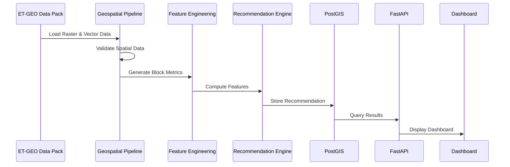

# VineMind AI
# Geospatial Processing Pipeline

---

| Property | Value |
|----------|-------|
| Document ID | VM-005 |
| Version | 1.0 |
| Status | Draft |
| Standard | OGC & GeoPython Best Practices |
| Project | VineMind AI |
| Author | Jeffrey Moepi |
| Last Updated | 16 July 2026 |
| Related Documents | VM-003 System Architecture, VM-004 Data Architecture |

---

# Table of Contents

1. Introduction
2. Pipeline Objectives
3. Geospatial Technology Stack
4. Supported Data Sources
5. Processing Workflow
6. Data Validation
7. Coordinate Reference Systems
8. Raster Processing
9. Vector Processing
10. Spatial Aggregation
11. Feature Engineering
12. Recommendation Dataset
13. Error Handling
14. Performance Optimisation
15. Future Enhancements

---

# 1. Introduction

The Geospatial Processing Pipeline is responsible for transforming raw ET-GEO datasets into structured vineyard intelligence.

Rather than displaying satellite imagery directly, the pipeline converts raster observations into vineyard-block metrics that power irrigation recommendations.

Every recommendation shown within VineMind AI originates from this pipeline.

---

# 2. Pipeline Objectives

The pipeline must:

✓ Import ET-GEO datasets

✓ Validate spatial integrity

✓ Aggregate raster values by vineyard block

✓ Generate analytical features

✓ Store processed observations

✓ Feed the Recommendation Engine

✓ Produce reproducible outputs

---

# 3. Geospatial Technology Stack

| Component | Technology |
|------------|------------|
| Raster Processing | Rasterio |
| Vector Processing | GeoPandas |
| Geometry Operations | Shapely |
| Numerical Computing | NumPy |
| Data Analysis | Pandas |
| Spatial Database | PostGIS |
| CRS Transformations | PyProj |
| Optional Raster Analytics | Rasterstats |

---

# 4. Supported Data Sources

## Raster Datasets

- ETa
- ETo
- Crop Coefficient (Kc)
- NDVI
- Sentinel-2

---

## Vector Datasets

- Vineyard Blocks
- Farm Boundaries

---

## Tabular Data

- Phenology
- Soil Moisture
- Weather
- Cultivar Information

---

# 5. Processing Workflow

```text
ET-GEO Data Pack

↓

Validate Files

↓

Load Vineyard Polygons

↓

Load GeoTIFF

↓

Coordinate Alignment

↓

Clip Raster

↓

Calculate Block Statistics

↓

Generate Features

↓

Calculate Water Stress

↓

Generate Recommendation

↓

Persist Results

↓

Serve Dashboard
```

---

# 6. Data Validation

Before processing begins, every dataset undergoes validation.

Checks include:

✓ File integrity

✓ CRS compatibility

✓ Geometry validity

✓ Missing values

✓ Duplicate vineyard blocks

✓ Raster dimensions

✓ Date consistency

Datasets that fail validation are quarantined for review.

---

# 7. Coordinate Reference Systems

To ensure accurate spatial calculations:

- All datasets are reprojected to a common CRS.
- Vineyard polygons and rasters must share the same coordinate reference system.
- Area calculations are always performed in a projected CRS suitable for South Africa.

Example workflow:

```text
Raw Raster
↓

Detect CRS
↓

Transform if Required
↓

Validate Alignment
↓

Ready for Analysis
```

---

# 8. Raster Processing

Each raster is processed independently.

Processing steps:

1. Open GeoTIFF
2. Read metadata
3. Read pixel values
4. Handle NoData values
5. Mask outside vineyard
6. Calculate statistics

Statistics generated:

- Mean
- Median
- Minimum
- Maximum
- Standard Deviation
- Pixel Count

These statistics become vineyard-level metrics.

---

# 9. Vector Processing

Vineyard polygons are the canonical spatial entity.

Processing includes:

- Geometry validation
- Polygon repair (if necessary)
- Area calculation
- Centroid calculation
- Bounding box generation
- Spatial indexing

Each vineyard receives a unique identifier used throughout the platform.

---

# 10. Spatial Aggregation

Raster observations are aggregated into vineyard-level summaries.

Example:

```text
NDVI Raster

↓

Block 12 Polygon

↓

Intersect Pixels

↓

Mean NDVI

↓

Store Result
```

The same process is repeated for:

- ETa
- ETo
- Kc
- Soil Moisture

This transforms millions of pixels into actionable vineyard metrics.

---

# 11. Feature Engineering

Raw environmental measurements are converted into analytical features.

Examples:

## Water Deficit

Water Deficit = ETo − ETa

---

## ET Ratio

ET Ratio = ETa / ETo

---

## Vegetation Trend

NDVI(Current) − NDVI(Previous)

---

## Soil Moisture Status

Current Soil Moisture ÷ Seasonal Average

---

## Rainfall Offset

Forecast Rainfall − Recommended Irrigation

---

## Phenology Weight

Assign sensitivity weights based on:

- Bud Break
- Flowering
- Fruit Set
- Veraison
- Ripening
- Harvest

These engineered features provide the inputs required by the Recommendation Engine.

---

# 12. Recommendation Dataset

Each vineyard block produces one daily analytical record.

Example:

| Field | Example |
|--------|----------|
| Block ID | B12 |
| Date | 2026-07-16 |
| ETa | 4.8 mm |
| ETo | 6.1 mm |
| NDVI | 0.72 |
| Water Deficit | 1.3 mm |
| Stress Score | 81 |
| Recommendation | Irrigate Tonight |
| Confidence | High |

This dataset is persisted and made available through the API.

---

# 13. Error Handling

The pipeline is designed to fail gracefully.

Scenario:

Missing NDVI

↓

Use Previous Observation

↓

Flag Reduced Confidence

---

Scenario:

Weather API Offline

↓

Use Cached Forecast

↓

Log Warning

---

Scenario:

Invalid Geometry

↓

Attempt Repair

↓

If Unsuccessful

↓

Exclude Block

↓

Notify Administrator

---

# 14. Performance Optimisation

To support large vineyards and future multi-farm deployments:

- Spatial indexing (PostGIS)
- Raster windowing
- Incremental processing
- Parallel feature generation
- Cached weather responses
- Background processing
- Batch database writes

Target performance:

- Process 100 vineyard blocks in under 30 seconds
- Generate dashboard-ready recommendations in under 5 seconds

---

# 15. Future Enhancements

Future pipeline capabilities may include:

- Drone orthomosaic ingestion
- Real-time IoT sensor streams
- Hyperspectral imagery
- Satellite change detection
- Machine learning feature extraction
- Predictive water demand modelling
- Automatic anomaly detection
- Digital twin vineyard simulation

---

# Appendix A
## Pipeline Sequence



---

# Appendix B
## Pipeline Outputs

The pipeline produces:

- Block-level ETa
- Block-level ETo
- NDVI metrics
- Water Deficit
- ET Ratio
- Phenology Stage
- Soil Moisture Status
- Weather Context
- Water Stress Score
- Irrigation Recommendation
- Confidence Level
- Historical Time-Series

---

# Conclusion

The Geospatial Processing Pipeline is the analytical backbone of VineMind AI.

It transforms heterogeneous geospatial datasets into structured vineyard intelligence using transparent, reproducible processing steps.

By aggregating environmental observations at the vineyard-block level and engineering meaningful analytical features, the pipeline enables the Recommendation Engine to deliver explainable irrigation guidance that aligns with the objectives of the TerraClim ET-GEO Hackathon.