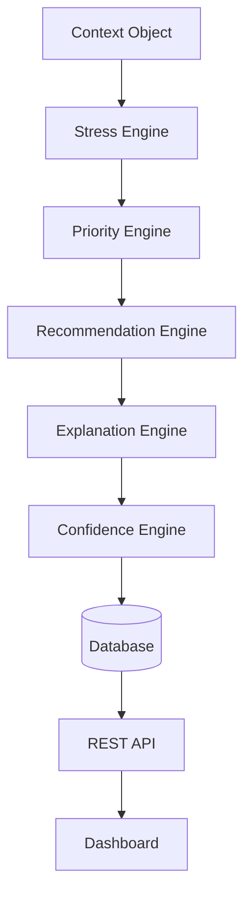

# VineMind AI
# Decision Intelligence Engine

---

| Property | Value |
|----------|-------|
| Document ID | VM-006 |
| Version | 1.0 |
| Status | Draft |
| Project | VineMind AI |
| Author | Jeffrey Moepi |
| Related Documents | VM-004 Data Architecture, VM-005 Geospatial Processing Pipeline |

---

# Table of Contents

1. Introduction
2. Objectives
3. Decision Philosophy
4. Decision Architecture
5. Context Engine
6. Water Stress Engine
7. Priority Engine
8. Recommendation Engine
9. Explanation Engine
10. Confidence Engine
11. Decision Lifecycle
12. Decision Rules
13. Explainability
14. Future AI Evolution

---

# 1. Introduction

The Decision Intelligence Engine transforms processed environmental observations into operational irrigation guidance.

Rather than relying on fixed thresholds alone, the engine evaluates multiple indicators simultaneously to produce recommendations that are explainable, prioritised and reproducible.

Every recommendation is accompanied by the evidence that influenced it.

---

# 2. Objectives

The engine shall:

- Evaluate vineyard conditions holistically
- Prioritise irrigation actions
- Explain every recommendation
- Quantify confidence
- Support future machine learning integration
- Produce deterministic outputs for identical inputs

---

# 3. Decision Philosophy

Recommendations should never rely on a single dataset.

Instead, every decision combines:

- Water demand
- Plant condition
- Soil condition
- Weather outlook
- Growth stage
- Historical behaviour

The recommendation is therefore evidence-based rather than threshold-based.

---

# 4. Decision Architecture

```text
Processed Features
        │
        ▼
Context Engine
        │
        ▼
Water Stress Engine
        │
        ▼
Priority Engine
        │
        ▼
Recommendation Engine
        │
        ▼
Explanation Engine
        │
        ▼
REST API
```

---

# 5. Context Engine

The Context Engine assembles all information required for a single vineyard block.

Inputs:

- ETa
- ETo
- NDVI
- Crop Coefficient
- Soil Moisture
- Phenology
- Rain Forecast
- Temperature
- Historical Trends

Output:

Unified Vineyard Context Object

The remainder of the pipeline works exclusively with this object.

---

# 6. Water Stress Engine

The Water Stress Engine estimates the irrigation urgency for a vineyard block.

Example contributing indicators:

- Water Deficit
- ET Ratio
- NDVI Trend
- Soil Moisture
- Rainfall Probability
- Phenological Sensitivity

Outputs:

- Water Stress Score (0–100)
- Stress Category

Stress Categories:

| Score | Category |
|--------|----------|
| 0–20 | Healthy |
| 21–40 | Monitor |
| 41–60 | Moderate Stress |
| 61–80 | High Stress |
| 81–100 | Critical |

---

# 7. Priority Engine

Not every stressed vineyard requires immediate irrigation.

The Priority Engine ranks vineyard blocks by urgency.

Priority calculation considers:

- Stress score
- Vineyard size
- Growth stage
- Forecast rainfall
- Historical trend
- Consecutive stress days

Output:

Daily irrigation queue.

---

# 8. Recommendation Engine

The Recommendation Engine converts analytical scores into operational actions.

Possible recommendations:

- Irrigate Immediately
- Irrigate Tonight
- Delay Irrigation
- Monitor Tomorrow
- No Action Required

Each recommendation includes:

- Recommended action
- Estimated irrigation volume
- Urgency
- Expected outcome

---

# 9. Explanation Engine

Every recommendation must be transparent.

Example output:

Recommendation:

Irrigate Tonight

Reasoning:

- High water deficit
- Declining NDVI
- Soil moisture below seasonal average
- No rainfall expected
- Vineyard at veraison stage

This enables users to validate the recommendation.

---

# 10. Confidence Engine

Confidence reflects the quality and completeness of the evidence available.

Factors influencing confidence:

- Data freshness
- Missing observations
- Weather reliability
- Spatial coverage
- Historical consistency

Example:

| Confidence | Meaning |
|------------|---------|
| High | Complete and recent data |
| Medium | Minor data gaps |
| Low | Significant uncertainty |

---

# 11. Decision Lifecycle

```text
Receive Vineyard Context
        │
        ▼
Evaluate Indicators
        │
        ▼
Calculate Stress
        │
        ▼
Rank Priority
        │
        ▼
Generate Recommendation
        │
        ▼
Generate Explanation
        │
        ▼
Assign Confidence
        │
        ▼
Persist Result
```

---

# 12. Decision Rules

Example rule:

IF

Water Deficit > Threshold

AND

Rain Forecast < 5 mm

AND

Stress Score > 75

THEN

Recommendation = Irrigate Tonight

---

Another example:

IF

Stress Score < 30

AND

Rain Forecast > 10 mm

THEN

Recommendation = Hold Irrigation

Rules remain configurable rather than hard-coded.

---

# 13. Explainability

Every recommendation stores:

- Input datasets
- Engine version
- Rules evaluated
- Final score
- Explanation
- Confidence
- Timestamp

This enables complete auditability.

---

# 14. Future AI Evolution

Future versions may replace rule-based scoring with:

- Gradient Boosted Trees
- Bayesian Networks
- Reinforcement Learning
- Time-Series Forecasting
- Large Language Model summaries

The surrounding architecture remains unchanged, ensuring future models can be introduced without redesigning the platform.

---

# Appendix A
## Decision Flow



---

# Appendix B
## Core Decision Outputs

Every vineyard block produces:

- Water Stress Score
- Stress Category
- Priority Rank
- Irrigation Recommendation
- Estimated Water Requirement
- Confidence Level
- Explanation
- Timestamp
- Decision Version

---

# Conclusion

The Decision Intelligence Engine is the cognitive core of VineMind AI.

By separating context assembly, stress evaluation, prioritisation, recommendation generation, and explanation into distinct components, the platform delivers transparent and reproducible irrigation guidance that vineyard managers can understand and trust.

Its modular design also allows future machine learning models to replace or enhance individual components without disrupting the overall architecture.