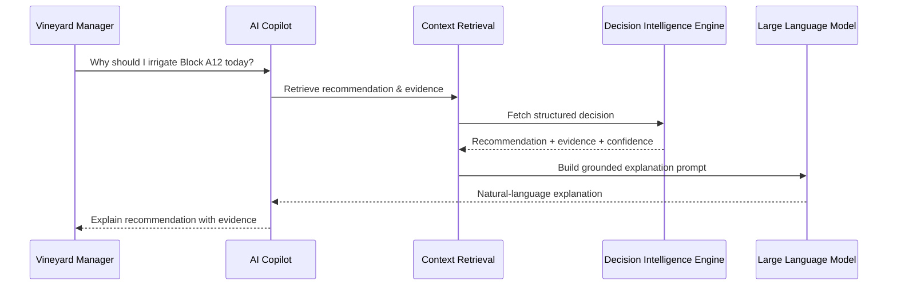

# VineMind AI
# Explainable AI Copilot

---

| Property | Value |
|----------|-------|
| Document ID | VM-007 |
| Version | 2.0 |
| Status | Draft |
| Project | VineMind AI |
| Layer | Explainability |
| Related Documents | VM-005 Geospatial Processing Pipeline, VM-006 Decision Intelligence Engine |

---

# Table of Contents

1. Overview
2. Purpose
3. Design Principles
4. High-Level Architecture
5. Responsibilities
6. Request Lifecycle
7. Context Retrieval
8. Explainability Engine
9. Prompt Engineering
10. Retrieval-Augmented Generation (RAG)
11. Conversation Management
12. Safety & Guardrails
13. Performance Targets
14. Future Evolution

---

# 1. Overview

The VineMind Explainable AI Copilot provides a conversational interface for vineyard managers.

Unlike traditional AI assistants that independently generate recommendations, the VineMind Copilot explains, interprets and communicates recommendations already produced by the Decision Intelligence Engine.

It acts as an intelligent interface between users and the platform's scientific decision-making components.

The Copilot never replaces agronomic models or business logic.

Its role is to make technical outputs understandable and actionable.

---

# 2. Purpose

The Copilot enables users to:

- Understand irrigation recommendations
- Ask natural-language questions
- Explore vineyard history
- Compare vineyard blocks
- Generate operational summaries
- Explain Water Stress Scores
- Produce printable reports
- Search historical recommendations
- Learn why a recommendation was produced

The Copilot does not calculate irrigation recommendations.

---

# 3. Design Principles

## Explain Rather Than Decide

The Decision Intelligence Engine remains the single source of truth.

The Copilot explains decisions but never creates new agronomic recommendations.

---

## Ground Every Response

Every response must reference platform data.

No unsupported recommendations may be generated.

---

## Human-Centred Communication

Scientific outputs are translated into clear language suitable for vineyard managers.

---

## Transparency

Every explanation should include:

- Evidence
- Confidence
- Source datasets
- Timestamp

---

## Deterministic Decisioning

Two identical datasets always produce the same recommendation.

The Copilot may express the explanation differently, but never change the underlying decision.

---

# 4. High-Level Architecture

```text
                      Vineyard Manager
                              │
                              ▼
                  Explainable AI Copilot
                              │
                 Intent Classification
                              │
                              ▼
                  Context Retrieval (RAG)
                              │
                              ▼
          Decision Intelligence Repository
                              │
                              ▼
               Explanation Prompt Builder
                              │
                              ▼
                    Large Language Model
                              │
                              ▼
                  Human-Friendly Response
```

The Copilot consumes decisions rather than generating them.

---

# 5. Responsibilities

The Copilot supports the following capabilities.

| Capability | Supported |
|------------|-----------|
| Explain irrigation recommendations | ✓ |
| Explain Water Stress Scores | ✓ |
| Compare vineyard blocks | ✓ |
| Summarise vineyard health | ✓ |
| Search historical recommendations | ✓ |
| Generate reports | ✓ |
| Answer operational questions | ✓ |
| Explain trends | ✓ |
| Produce irrigation decisions | ✗ |
| Override recommendations | ✗ |
| Execute irrigation schedules | ✗ |

---

# 6. Request Lifecycle

```text
User Question

↓

Intent Detection

↓

Entity Extraction

↓

Retrieve Recommendation

↓

Retrieve Supporting Evidence

↓

Build Context

↓

Generate Explanation Prompt

↓

Large Language Model

↓

Validated Response

↓

User
```

---

# 7. Context Retrieval

The Copilot assembles all evidence required to explain a recommendation.

Example context:

- Vineyard block
- ETa
- ETo
- NDVI
- Water Deficit
- Water Stress Score
- Stress Category
- Rain Forecast
- Phenology Stage
- Historical Trend
- Recommendation
- Confidence

No reasoning occurs at this stage.

---

# 8. Explainability Engine

The Explainability Engine transforms structured outputs into natural-language explanations.

Example structured output:

```json
{
  "block": "A12",
  "stress_score": 82,
  "recommendation": "Irrigate Tonight",
  "confidence": 0.94,
  "evidence": [
    "Water deficit of 1.4 mm",
    "NDVI declined compared with previous observation",
    "No rainfall forecast",
    "Phenology stage: Veraison"
  ]
}
```

Example response:

> **Recommendation:** Irrigate Block A12 tonight.
>
> The vineyard is experiencing a high water deficit of approximately 1.4 mm. Vegetation health has declined since the previous observation, no meaningful rainfall is expected, and the vines are currently at the veraison stage where water stress can reduce berry quality. Based on these combined factors, the Decision Intelligence Engine has assigned a Water Stress Score of 82 with high confidence.

---

# 9. Prompt Engineering

The Copilot uses structured prompts that separate instructions from evidence.

Example prompt structure:

```text
SYSTEM

You are an agricultural decision explanation assistant.

Never invent recommendations.

Only explain supplied evidence.

Always include confidence.

USER CONTEXT

Recommendation:
Irrigate Tonight

Stress Score:
82

Evidence:
- Water Deficit 1.4 mm
- NDVI Declining
- No Rain Forecast
- Veraison Stage

TASK

Explain this recommendation in plain language.
```

This approach reduces hallucinations and improves consistency.

---

# 10. Retrieval-Augmented Generation (RAG)

The Copilot retrieves information from trusted platform sources before generating a response.

## Retrieval Sources

| Source | Purpose |
|---------|----------|
| Recommendation Database | Latest recommendations |
| Historical Recommendation Store | Trends |
| Water Stress Model | Scoring explanation |
| Weather Data | Forecast context |
| Vineyard Metadata | Block details |
| User Preferences | Language and units |
| Documentation | Definitions and guidance |

The language model does not rely on memory alone.

---

# 11. Conversation Management

Each conversation maintains contextual awareness.

Stored context includes:

- Current vineyard
- Selected block
- Recent questions
- Preferred units
- Preferred language

Example:

User:

> Why is Block A12 stressed?

Follow-up:

> What about yesterday?

The Copilot resolves the reference to the same vineyard block without requiring the user to repeat it.

---

# 12. Safety & Guardrails

The Copilot follows strict safety rules.

## Never

- Invent irrigation recommendations
- Override the Decision Intelligence Engine
- Modify historical records
- Execute operational changes
- Guess missing data

## Always

- Cite supporting evidence
- Display confidence
- Acknowledge uncertainty
- Explain limitations
- State when data is unavailable

---

# 13. Performance Targets

| Metric | Target |
|---------|--------|
| Response Time | < 3 seconds |
| Explanation Accuracy | > 95% |
| Hallucination Rate | < 1% |
| Recommendation Fidelity | 100% |
| User Satisfaction | > 4.5 / 5 |

---

# 14. Future Evolution

Future capabilities may include:

- Voice interaction
- Multilingual vineyard support
- Image-based vineyard explanations
- Interactive recommendation walkthroughs
- AI-generated seasonal summaries
- Mobile assistant
- Offline field mode
- Wearable device integration

These enhancements will continue to use the Decision Intelligence Engine as the authoritative source for agronomic recommendations.

---

# Appendix A
## End-to-End Interaction Flow



---

# Appendix B
## Example User Questions

- Why does Block B14 need irrigation today?
- Which vineyard has the highest Water Stress Score?
- Compare Block A12 with yesterday.
- Explain why irrigation was delayed.
- Show the trend for ETa over the last seven days.
- Which recommendations have low confidence?
- Summarise today's irrigation priorities.
- Explain the Water Stress Score in simple language.

---

# Conclusion

The VineMind Explainable AI Copilot provides an intuitive conversational interface that makes complex geospatial analytics and irrigation recommendations accessible to vineyard managers.

By separating scientific decision-making from natural-language explanation, the platform remains transparent, reproducible and trustworthy. Every response is grounded in evidence produced by the Decision Intelligence Engine, ensuring that users receive explanations they can understand without compromising the integrity of the underlying agronomic models.