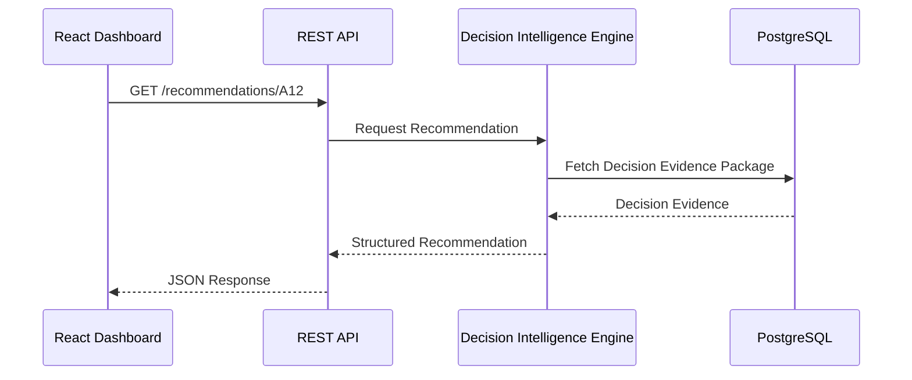

# VineMind AI
# API Specification

---

| Property | Value |
|----------|-------|
| Document ID | VM-008 |
| Version | 1.0 |
| Status | Draft |
| Standard | REST API Specification |
| Project | VineMind AI |
| Author | Jeffrey Moepi |
| Last Updated | 16 July 2026 |
| Related Documents | VM-003 System Architecture, VM-006 Decision Intelligence Engine |

---

# Table of Contents

1. Introduction
2. API Principles
3. Architecture
4. Authentication
5. Resource Model
6. Endpoint Catalogue
7. Decision Evidence Package
8. Error Handling
9. Versioning
10. Performance
11. Security
12. Future APIs

---

# 1. Introduction

The VineMind API provides a secure REST interface that exposes vineyard intelligence, irrigation recommendations, historical analytics and explainable decision data.

The API is designed to be:

- Predictable
- Stateless
- Versioned
- Secure
- Easily consumable by web and mobile applications

The API never performs irrigation calculations directly.

Scientific processing remains within the Decision Intelligence Engine.

---

# 2. API Principles

The API follows these principles:

- RESTful resource design
- JSON request and response bodies
- Stateless communication
- HTTPS only
- Versioned endpoints
- Idempotent GET operations
- Standard HTTP status codes

---

# 3. High-Level Architecture

```text
React Dashboard
        │
        ▼
REST API
        │
        ▼
Decision Intelligence Engine
        │
        ▼
Water Stress Model
        │
        ▼
PostgreSQL + PostGIS
```

The API acts as a gateway to platform services.

---

# 4. Authentication

Version 1 uses JWT authentication.

```text
User Login

↓

JWT Issued

↓

Authenticated Requests

↓

Token Validation

↓

API Access
```

Example Header

```http
Authorization: Bearer <jwt_token>
```

---

# 5. Resource Model

Primary resources include:

- Vineyards
- Vineyard Blocks
- Recommendations
- Water Stress Scores
- Weather
- Historical Metrics
- Reports
- Decision Evidence Packages

---

# 6. Endpoint Catalogue

## Authentication

| Method | Endpoint | Description |
|--------|----------|-------------|
| POST | /api/v1/auth/login | User login |
| POST | /api/v1/auth/refresh | Refresh JWT |

---

## Vineyards

| Method | Endpoint |
|--------|----------|
| GET | /api/v1/vineyards |
| GET | /api/v1/vineyards/{id} |

---

## Vineyard Blocks

| Method | Endpoint |
|--------|----------|
| GET | /api/v1/blocks |
| GET | /api/v1/blocks/{id} |

---

## Water Stress

| Method | Endpoint |
|--------|----------|
| GET | /api/v1/stress/{blockId} |
| GET | /api/v1/stress/history/{blockId} |

Example Response

```json
{
  "block_id": "A12",
  "stress_score": 82,
  "category": "Critical",
  "confidence": 0.94,
  "generated_at": "2026-07-16T08:00:00Z"
}
```

---

## Recommendations

| Method | Endpoint |
|--------|----------|
| GET | /api/v1/recommendations |
| GET | /api/v1/recommendations/{blockId} |

Example

```json
{
  "recommendation": "Irrigate Tonight",
  "priority": 1,
  "confidence": 0.94
}
```

---

## Decision Evidence Package

| Method | Endpoint |
|--------|----------|
| GET | /api/v1/evidence/{blockId} |

Example Response

```json
{
  "decision_id": "DEP-20260716-A12",
  "stress_score": 82,
  "recommendation": "Irrigate Tonight",
  "confidence": 0.94,
  "evidence": [
    {
      "metric": "Water Deficit",
      "value": 1.4,
      "unit": "mm"
    },
    {
      "metric": "NDVI Trend",
      "value": "Declining"
    },
    {
      "metric": "Rain Forecast",
      "value": 0,
      "unit": "mm"
    },
    {
      "metric": "Phenology",
      "value": "Veraison"
    }
  ]
}
```

---

## AI Copilot

| Method | Endpoint |
|--------|----------|
| POST | /api/v1/copilot/chat |

Example Request

```json
{
  "message": "Why should I irrigate Block A12 today?"
}
```

Example Response

```json
{
  "answer": "Block A12 is recommended for irrigation because...",
  "decision_id": "DEP-20260716-A12"
}
```

---

# 7. Decision Evidence Package

Every recommendation references a Decision Evidence Package (DEP).

The DEP acts as the authoritative explanation for:

- Dashboard
- AI Copilot
- Reports
- Future Mobile Apps
- External Integrations

No interface should invent or modify recommendation evidence.

---

# 8. Error Handling

Standard HTTP status codes are used.

| Code | Meaning |
|------|---------|
| 200 | Success |
| 201 | Created |
| 400 | Bad Request |
| 401 | Unauthorized |
| 403 | Forbidden |
| 404 | Not Found |
| 422 | Validation Error |
| 500 | Internal Server Error |

Example Error

```json
{
  "error": {
    "code": "BLOCK_NOT_FOUND",
    "message": "Requested vineyard block does not exist."
  }
}
```

---

# 9. API Versioning

The API uses URI versioning.

```text
/api/v1/
```

Future releases:

```text
/api/v2/
/api/v3/
```

Older versions remain supported during migration periods.

---

# 10. Performance Targets

| Metric | Target |
|---------|--------|
| Average Response | <300 ms |
| P95 Response | <800 ms |
| Concurrent Users | 500+ |
| Availability | 99.9% |

---

# 11. Security

The API implements:

- HTTPS encryption
- JWT authentication
- Input validation
- Parameter sanitisation
- Role-Based Access Control (RBAC)
- Audit logging
- Rate limiting

Sensitive configuration is managed through environment variables.

---

# 12. Future APIs

Planned integrations include:

- Mobile application API
- WebSocket live updates
- GraphQL endpoint
- Public reporting API
- IoT sensor ingestion API
- Drone imagery upload API
- Weather provider abstraction layer

---

# Appendix A
## Request Flow



---

# Appendix B
## REST Design Principles

- Stateless requests
- Resource-oriented URLs
- Consistent JSON schemas
- Standard HTTP methods
- Explicit versioning
- Secure authentication
- Clear error contracts

---

# Conclusion

The VineMind REST API provides a secure, versioned and predictable interface for accessing vineyard intelligence across web, mobile and AI-assisted experiences.

By exposing recommendations through structured resources and Decision Evidence Packages rather than calculation logic, the API preserves the integrity of the Decision Intelligence Engine while enabling scalable integration with future applications and services.